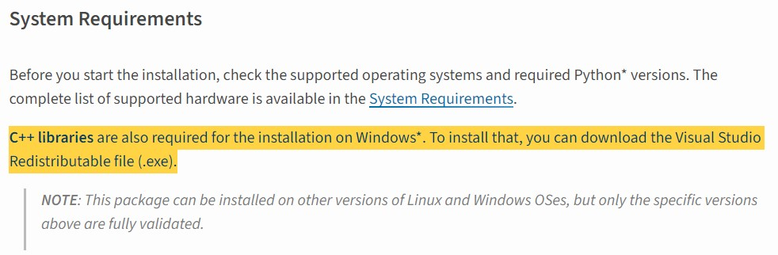

# SSD Waveform Classifier
Classify the SSD read/write waveform by using iVIT.
<table border="0">
 <tr>
    <td>


    </td>
    <td>


    </td>
 </tr>
</table>
 
# How to use?
1. Mount innodisk network device using [MapNetworkDrive.bat](./MapNetworkDrive.bat) 
1. Prepare AIDA64, Model, Process file.
1. Modify the path of each files in [`config.ini`](config.ini).
2. Launch [`classifier.exe`](classifier.exe) with administrator.


# For Developer
* Prepare environment
    
    Using python and virtualenv to handle the project environment.
    1. Install `Python 3.8.10` ( [Click to download](https://www.python.org/ftp/python/3.8.10/python-3.8.10-amd64.exe) )
        <details>
        <summary>Notice: have to add Python3.8 to PATH ( Screenshot )</summary>
        
        
        
        </details> 
        
    2. Install [the Visual Studio Redistributable file.](https://pypi.org/project/openvino/)
        <details>
        <summary>C++ libraries are also required for the installation on Windows</summary>
        
        
        
        </details> 
        
    3. Install OpenVINO with Virtualenv
        <details>
        <summary>Workflow</summary>
        
        ```bash
        # Create virtual environment
        python -m venv openvino_env
        # Launch environment
        openvino_env\\Scripts\\activate.bat
        # Install OpenVINO
        python -m pip install openvino==2022.3.0
        # Verify
        python -c "from openvino.runtime import Core; print(Core().available_devices)"
        ```
        </details> 
    4. Install another modules
        <details>
        <summary>Modules</summary>
        
        ```bash
        pip install opencv-python colorlog
        ```
        </details>

* Release
    
    Packaging to executable file:
    * Launch Evironment: `openvino_env\\Scripts\\activate.bat`
    * Requirement: `pip install pyinstaller`
    * Replace Icon ( [release\app.ico](release\app.ico) ) if you need.
    * Command: `python release`

# Test
```
cd Desktop\ssd__waveform_classifier
openvino_env\\Scripts\\activate.bat
python -c "from openvino.runtime import Core; print(Core().available_devices)"
```
